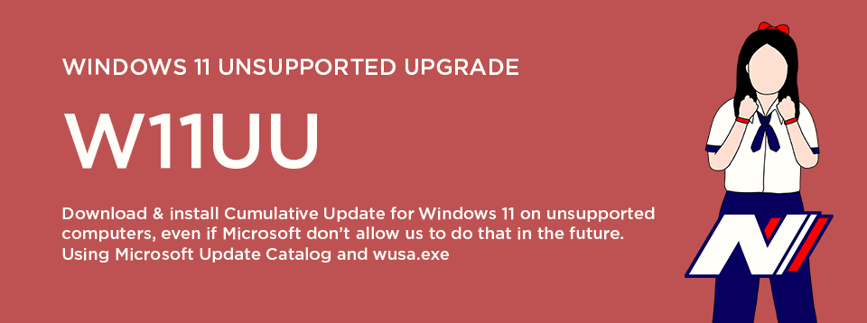
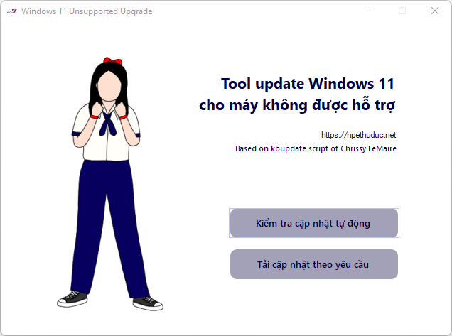
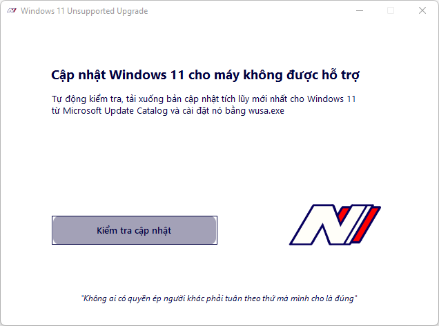
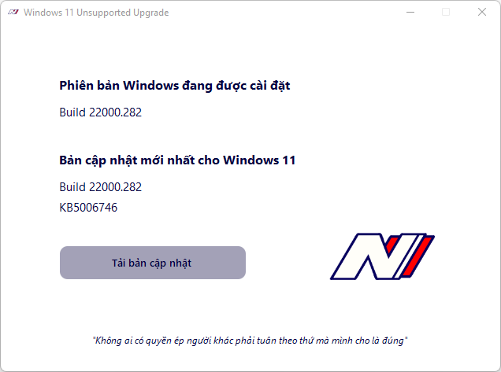
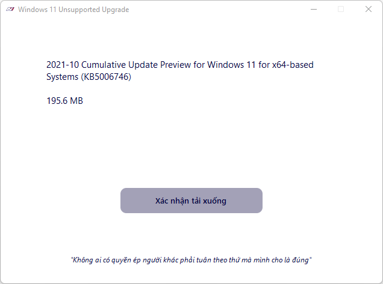
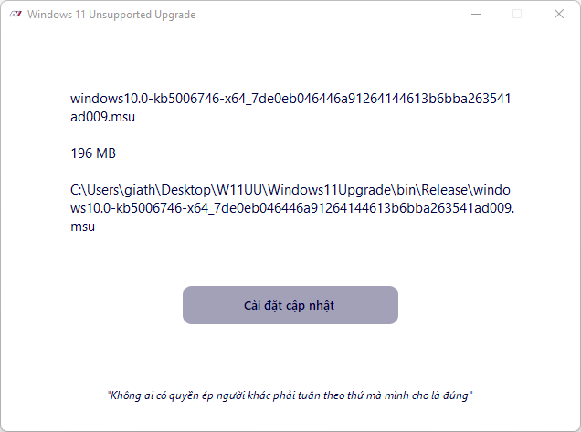
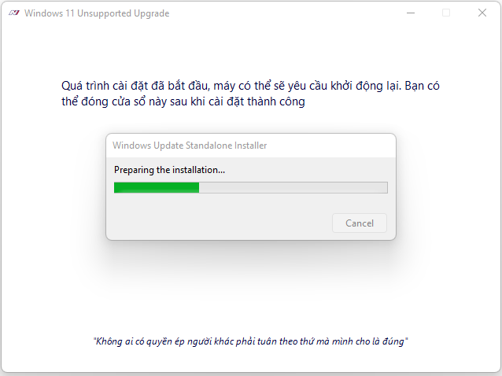
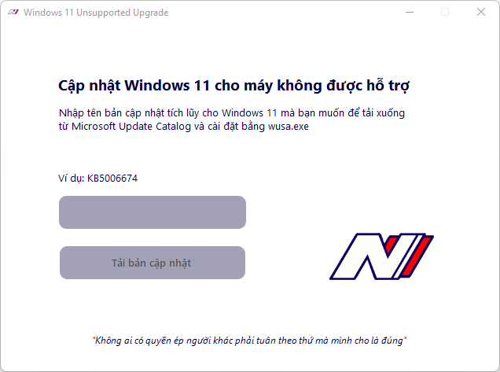
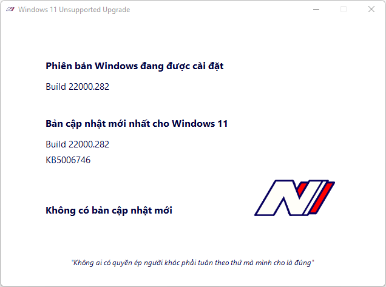

# Windows 11 Unsupported Upgrade (W11UU)

   
  
   

 

Microsoft said that if you try to install Windows 11 on unsupported computers, they will not allow you to receive any Cumulative Updates directly in Settings. 

While what they said is wrong now, unsupported computers still can receive Cumulative Updates directly in Settings. But no one can be sure that Microsoft will not change their mind. If in the future for some reason they change their mind, this is the tool to install Cumulative Updates on unsupported computers.

This is not the tool to install Windows 11 for unsupported computers. It is the tool to install Cumulative Updates for computers running Windows 11 without using Windows Update in Settings.

Briefly, about the mechanism of action, there are two things you need to keep in mind:
- Updates received from Windows Update in Settings can be downloaded manually from [Microsoft Update Catalog](https://catalog.update.microsoft.com) in .msu file format.
- Windows always have a so-called "Windows Update Standalone Installer", or wusa.exe to install .msu updates without a network connection, commonly used for business computers and specialized industrial computers.

By knowing those two, it is completely possible to download any Cumulative Update and install it on Windows 11 without any additional tools. This tool just automates that process by parsing the HTML at Microsoft's website to determine which updates to download in the Microsoft Update Catalog. Then it will use Chrissy LeMaire's Powershell script (trimmed and tweaked) to download the update. Finally, call wusa.exe to install the downloaded update.

Still under development and hasn't been tested under a good amount of circumstances. ISO download and install for Feature Update with be integrated soon. Feel free to use my code and create whatever you like. Together we can fight against the giants that force us to do what they think is right.

## Pictures

   
  
   
  Main menu, you can type the KB name manually or let the tool detect the newest update
   
   
  
   
  Check for newest update by parsing Microsoft's website
   
   
  
   
  New update available, you can download it
   
   
  
   
  Confirm to download the update from Microsoft Update Catalog
   
   
  
   
  Download completed sucessfully, you can install it with wusa.exe
   
   
  
   
  Installing the update with wusa.exe
   
   
  
   
  You can type the KB update names manually to download and install if you want
   
   
  
   
  No update available
   

## Credits
Credits to [Chrissy LeMaire](https://github.com/potatoqualitee/kbupdate) for kbupdate Powershell script.
